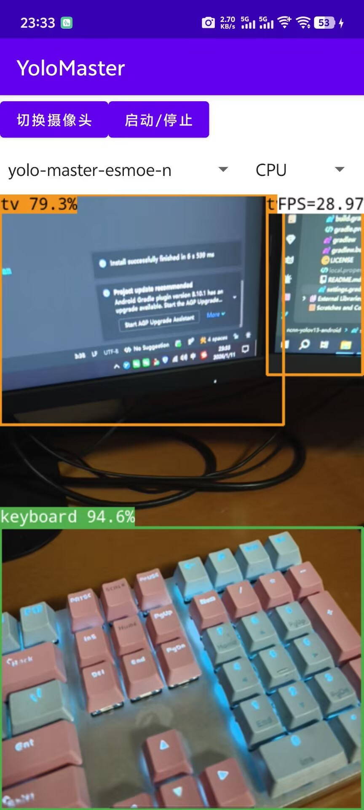

# ncnn-YOLO-Master-android

Implement Tencent's YOLO-Master model to run in Android.

实现腾讯的YOLO-Master模型Android中运行

YOLO-Master model supports android deployment. Yolov8, Yolov11, Yolov12 and Yolov13 can be supported.

## Please, have some stars for this repo. Thank you! 🌟🌟🌟🌟🌟

## Support the latest pnnx export

```python
# -*- coding: UTF-8 -*-
"""
  @Author: mpj
  @Date  : 2026/1/11 22:17
  @version V1.0
"""
from ultralytics import YOLO
import argparse

if __name__ == '__main__':
    parser = argparse.ArgumentParser()
    parser.add_argument('--p', type=str, default='./weights/yolo-master-esmoe-n.pt', help='model path')
    args = parser.parse_args()
    model = YOLO(args.p)
    model.export(**{
        'format': 'ncnn',
        'opset': 12,
        'simplify': True,
        'batch': 1,
        'imgsz': 320,
        # 'dynamic': True,
    })

```

file [
`native-lib.cpp`](./app/src/main/cpp/native-lib.cpp#L170)

``` c++
const int target_sizes[] =
{
    320,
    320,
};
```

## Visualization result

<table>
  <tr>
    <td></td>
  </tr>
</table>

## Bug

